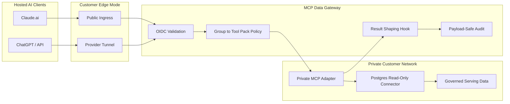

# Architecture

MCP Data Gateway is a customer-controlled enforcement point between hosted AI clients and private tools. It keeps the hosted client integration small and reachable while keeping identity validation, tool authorization, connector allowlists, and audit inside the customer's environment.

## Control Points

- Edge mode controls transport reachability.
- OIDC validation controls who the gateway believes the caller is.
- Policy controls which tool pack the caller can invoke.
- Connector permissions control what the private adapter can read.
- Result shaping controls what returns to the hosted client.
- Audit records what happened without storing raw sensitive payloads by default.

## Boundary Rule

Never expose the private adapter directly to the internet. Expose only the gateway or a provider tunnel target that forwards to the gateway.

## Current MVP Boundary

The current implementation is a pre-alpha proof path, not a complete data-governance platform. It includes OIDC validation, group-to-tool-pack policy, SDK-backed MCP handling, a read-only Postgres tool with table/column allowlists, passthrough result shaping, and payload-safe audit. Helm packaging, SBOM/signing, and data-level result filtering remain future work.
